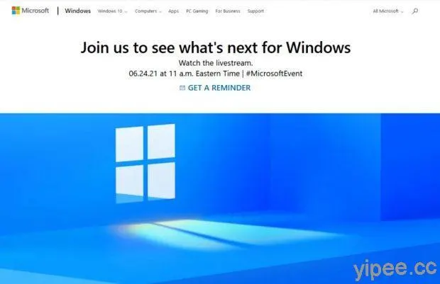
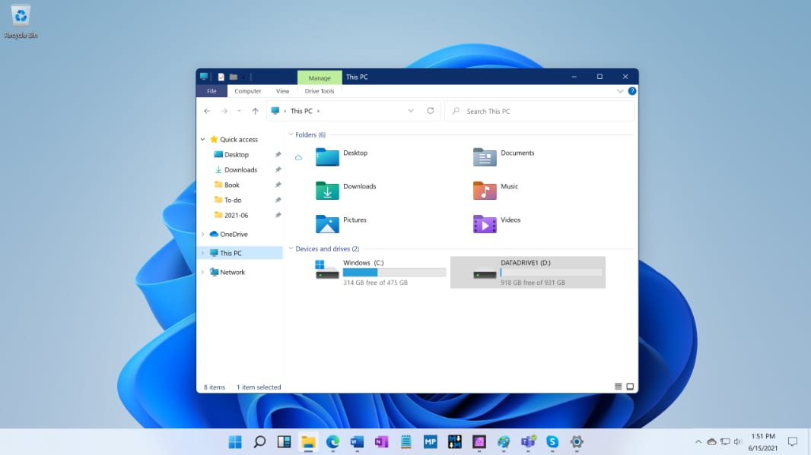
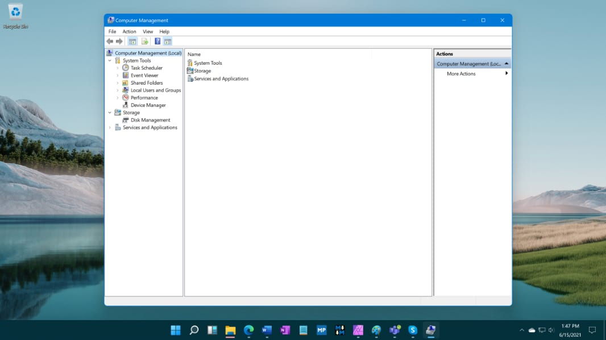
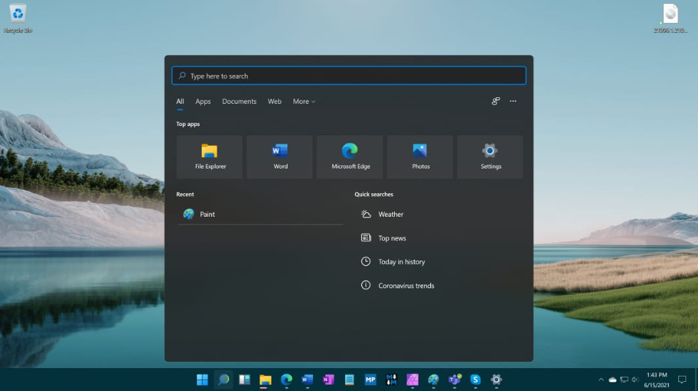

# 微軟又調皮哦 Windows 11即將上線啦

自微軟2015年出來, Windows 10 給大家很多很有特色的功能，也說Windows 10 是最後一次的Windows的版本，
如今2021年微軟又要打自己的臉，在2021年6月24日發表Windows 11 

這次的設計比Windows 10來的圓潤，圖型很UINX，下方的Taskbar置中，很乾淨
平常在做程式開發時用的環境是LINUX，這次Windows 11 使用的觀感和LINUX不會差很多哦

詳細的資訊就等6月24日微軟親自公佈啦

## 圖均來自官方網站
