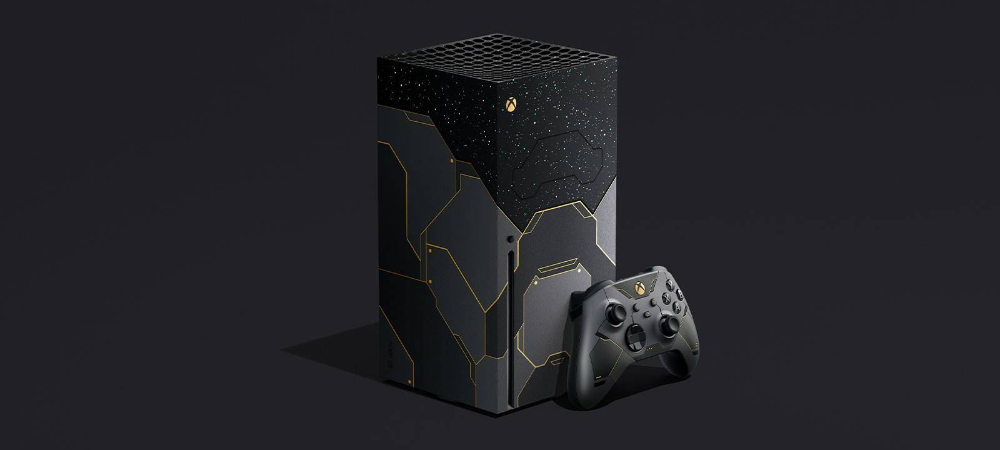

## 微軟宣佈Halo Infinite要在今年12月8日上市，同時也有限量版上市

Halo Infinite 由微軟工作室旗下 343 Industries 開發，採用全新「Slipspace Engine」遊戲引擎製作。故事接續在《 Halo 5: Guardians》之後，在太空漂流已陷入絕望的聯合國太空司令部（UNSC）士兵，發現在宇宙空間中陷入沉眠的系列傳奇英雄士官長，並成功讓其甦醒，重新投入攸關人類存亡的戰役

當天上市也會有Xbox Series X Halo Infinite ，玩家可以拿優質的遙桿來大殺特殺哦

